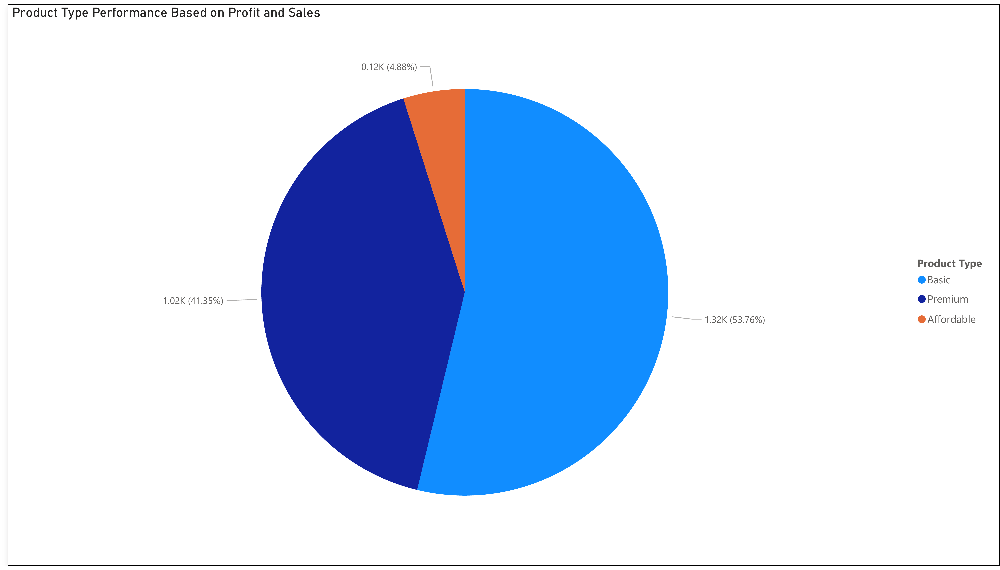
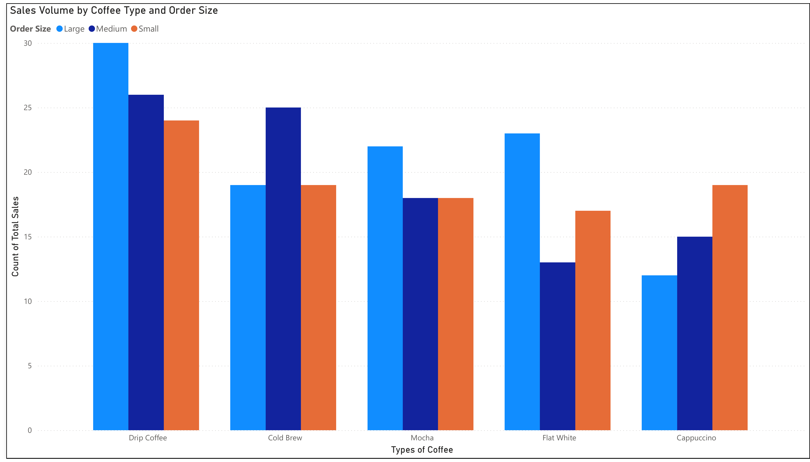
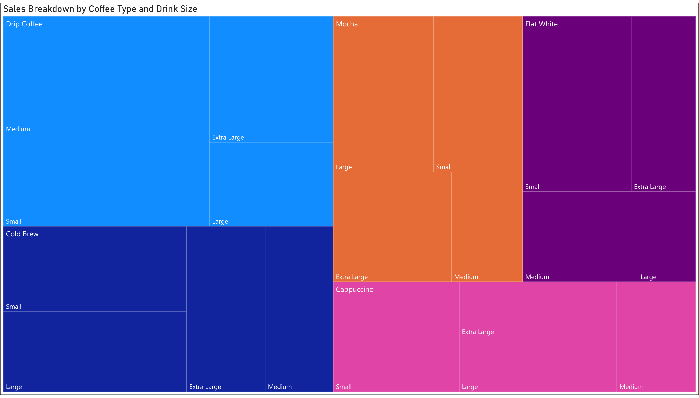
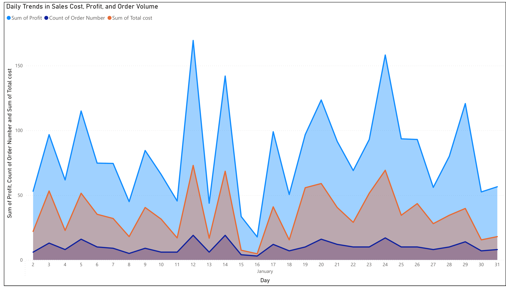
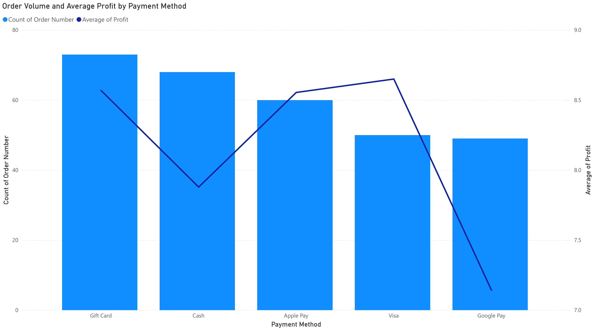
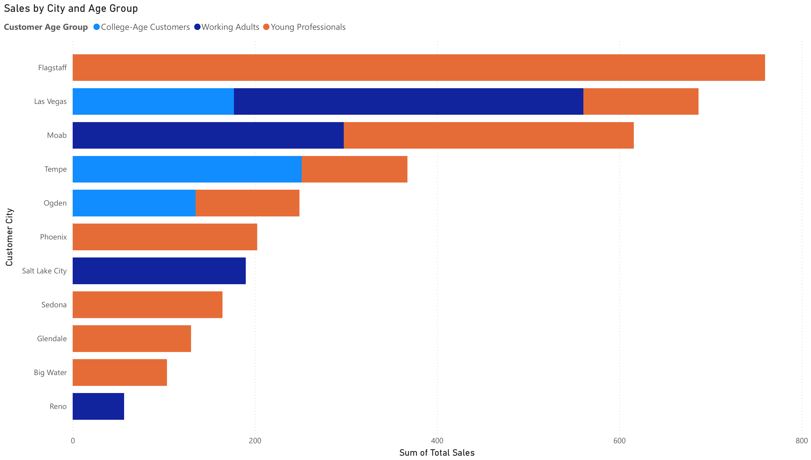

# Coffee Shop Sales Analysis

### From a raw spreadsheet to a Power BI dashboard, and the business decision it points to

**By Vamshi Aitharaju**

`Power Query` `Data Cleaning` `Conditional Columns` `Star Schema` `Data Modeling` `Power BI` `DAX` `Dashboard Design` `Business Reporting`

---

## The Question

I started this project with one goal: take a raw coffee shop sales dataset and turn it into an actual answer to a real business question. Not just clean charts, but a specific, defensible recommendation about where this business should focus its attention. The dataset covered orders, customers, products, locations, and payment methods across several hundred transactions. This README walks through exactly how I got from that raw file to a finished dashboard and a clear conclusion.

## Skills Demonstrated in This Project

| Skill | How I Used It Here |
|---|---|
| Power Query, column splitting | Split combined fields into separate, usable columns so each piece of information could be filtered and analyzed on its own |
| Power Query, conditional columns | Built a customer age group field from date of birth, a profit margin category from transaction data, and a cleaned drink size field |
| Power Query, text cleaning | Trimmed whitespace and standardized inconsistent text entries, such as city name spelling variations, so location based analysis would group correctly |
| Power Query, number formatting | Standardized decimal places and applied currency formatting to price, cost, and profit fields |
| Power Query, deduplication | Identified and removed duplicate rows so totals and averages reflect real, distinct transactions |
| Data modeling, star schema design | Split the dataset into Orders, Customers, and Products tables, added primary keys, and built the relationships between them |
| Power BI, DAX and dashboard design | Built the full interactive dashboard shown below, including filters, a treemap, and a time based trend view |
| Business analysis and reporting | Translated every chart into a specific, actionable recommendation rather than stopping at description |

## Chapter 1: Understanding the Data

**What I did:** Before touching anything, I opened the file and just looked. I checked the number of rows, reviewed every column, and used filters to hunt for anything unusual or inconsistent.

**Why:** You cannot clean data you do not understand. Filtering the city column early, for example, is how I found spelling differences and extra spaces that would have quietly broken any location-based analysis later on. Catching that kind of thing before building anything is what separates a reliable analysis from a fragile one.

**How:** I reviewed the dataset column by column, applying filters on text fields specifically to surface inconsistent entries. This gave me a clear list of what needed fixing before the real cleaning work began.

## Chapter 2: Cleaning and Preparing the Data in Power Query

This is where most of the real work happened, and where most of the value of the final dashboard actually comes from. A dashboard is only as good as the data behind it.

**Trimming and standardizing text**
Extra spaces and inconsistent spelling in fields like city names get treated as different values by Power BI even when they mean the same thing. I trimmed whitespace and standardized these entries so that every chart grouping by location would actually group correctly.

**Splitting columns**
Some fields in the raw data combined more than one piece of information into a single column. I split these into separate, usable fields so each one could be filtered and analyzed on its own, rather than being trapped inside a combined text string.

**Correcting formats and decimals**
Numeric fields like price, cost, and profit needed consistent formatting to be usable in calculations and visuals. I standardized these to a consistent number of decimal places and applied proper currency formatting with the dollar sign, so every dollar figure in the dashboard reads clearly and consistently instead of showing raw, inconsistent numbers.

**Removing duplicates**
Duplicate rows inflate totals and distort averages. I identified and removed them so every count and sum in the final analysis reflects real, distinct transactions.

**Building conditional columns**
This is where cleaning turns into actual analysis. Rather than transforming every possible column, I only built the new variables that would lead to a real insight:
- A **customer age group** column, built from date of birth, grouping customers into segments like young professionals, working adults, and college age customers
- A **profit margin category**, grouping each transaction into margin tiers so I could separate high-selling products from high-profit ones
- A **drink size** field, cleaned and standardized so it could be compared consistently across every coffee type

Each of these was a deliberate choice. I only built the fields that I knew would support a real chart and a real conclusion, instead of transforming everything just because I could.

## Chapter 3: Building the Data Model

**What I did:** I split the cleaned dataset into three related tables: Orders, Customers, and Products.

**Why:** A single flat table with everything crammed into it is hard to model and slow to filter. Splitting the data into proper subject-based tables, each with its own primary key, is the standard way to build something Power BI can actually use efficiently, and it mirrors how real business data is usually structured.

**How:** I added primary keys to each table and built relationships connecting them. That structure became a proper star schema in Power BI, the foundation every chart and filter in the final dashboard is built on top of.

## Chapter 4: The Dashboard, Chart by Chart

**1. Profit and Sales by Product Type**



Basic drinks produced the highest profit, 1.32K, which is 53.76 percent of total profit, from 1,729 sales. Premium drinks followed closely with 1,016 in profit from 1,653 sales. Affordable drinks barely registered, just 120 in profit from only 22 sales. The takeaway: a low price does not guarantee volume or profit. The business should keep its focus on basic and premium products, since together they account for almost all real value.

**2. Sales Volume by Coffee Type and Order Size**



Drip coffee in large size led with 30 orders. Cold brew was ordered mostly in medium size, and cappuccino mostly in small size. Adding the age group filter, built back in Chapter 2, showed that size preference actually shifts across customer segments. That is a useful detail for planning targeted upselling instead of a single generic promotion for everyone.

**3. Sales Breakdown by Coffee Type and Drink Size, Filtered by Profit Margin**



The most ordered combinations were not always the most profitable ones. Drip coffee in medium size and mocha in large size sold the most, but the profit margin filter showed many of these top sellers actually sit in low or medium margin tiers. Popularity and profitability are not the same thing, and this chart is the clearest proof of that in the whole analysis.

**4. Daily Trends in Sales Cost, Profit, and Order Volume**



A day by day view across January. The slowest day, January 16, had just 3 orders and $17.75 in profit. The strongest day, January 12, had 19 orders and $169.50 in profit. This kind of daily pattern is directly useful for staffing decisions, promotion timing, and inventory planning.

**5. Orders and Average Profit by Payment Method**



Gift cards produced the highest average profit per order at $8.57, ahead of cash at $7.88 across 68 orders. Google Pay had the most digital orders but the lowest average profit at $7.14. This is a clear, actionable insight. Incentivizing gift card usage could measurably raise average profit per order.

**6. Sales by City and Customer Age Group**



In Flagstaff, every single sale came from young professionals, totaling 760. Across nearly every city in the dataset, young professionals were the dominant customer group. That single pattern reframes the whole business strategy. Expansion planning, loyalty programs, and promotions should all be built around this group first.

## Chapter 5: The Conclusion

Not every high selling product is a high profit product. The real opportunity sits in the specific combinations that deliver both volume and margin at the same time. Size preference shifts by drink type and by customer age group. Payment method has a real, measurable effect on profitability. Daily and city level patterns both point back to the same underlying group.

**My recommendation:** focus on young professionals, promote the drink combinations that carry the highest margin, and actively encourage gift card payments. Together, these three moves target the highest leverage segment of this business with the least wasted effort.

📄 [Read the full written analysis](reports/Coffee_Shop_Sales_Analysis_Writeup.pdf) or [view the complete dashboard export](reports/Power_BI_Dashboard_Export.pdf)

---

## Tools and Skills Used

Power Query (data cleaning, column splitting, conditional columns, merged queries, decimal and currency formatting, grouping and aggregation), Data Modeling and Star Schema Design, Power BI (DAX, dashboard design), Business Insight Reporting, Data Storytelling

## Repository Structure

```
assets: real chart images from the Power BI dashboard
reports: the full written analysis and the complete dashboard export, both as PDF
```

Note on file formats: the original Power Query and Power BI working file is kept in a private archive. Every chart and finding it produced is shown here as real output. Nothing in this repository is a mockup.

---
### About the Author
**Vamshi Aitharaju**
Email: aitharajuvamshi@gmail.com
GitHub: [github.com/aitharajuvamshi-cell](https://github.com/aitharajuvamshi-cell)

Original individual coursework. Copyright 2026 Vamshi Aitharaju. All rights reserved.
